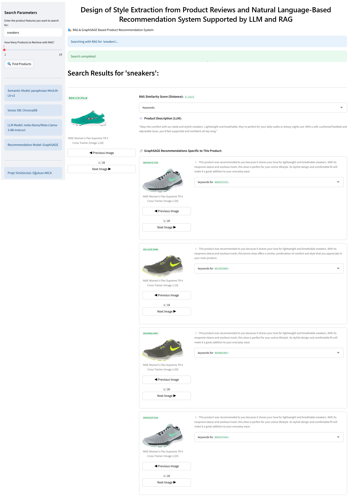
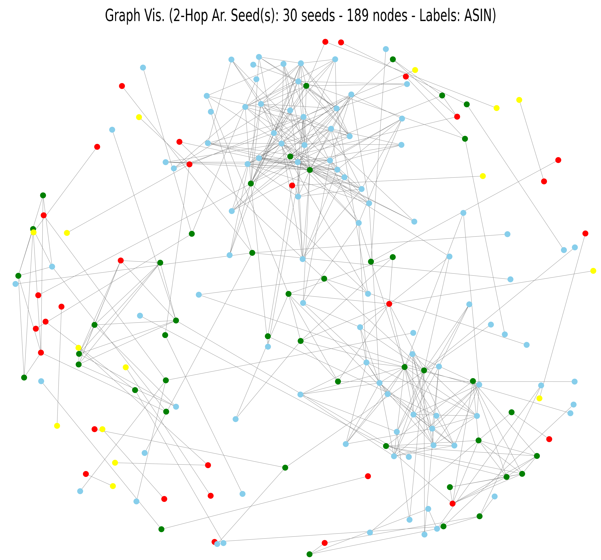

# TÜBİTAK 2209-A Project

## Design of Style Extraction from Product Reviews and Natural Language-Based Recommendation System Supported by LLM and RAG

## About the Project

This project presents an innovative product recommendation system that combines Retrieval-Augmented Generation (RAG) and Graph Neural Network (GraphSAGE) technologies to enhance user experience in e-commerce platforms.



### Objective

Going beyond traditional recommendation systems by:
- Automatically extracting style and feature information from product reviews
- Understanding user intent through natural language-based semantic search
- Modeling complex relationships between products using graph structure
- Providing transparent recommendations with LLM-supported explanation generation

### Innovative Approach

Our project integrates three main components:

1. **RAG (Retrieval-Augmented Generation)**: Semantic search using vector database
2. **GraphSAGE**: Deep learning model that learns product relationship graph
   > 
3. **LLM**: Generation of product descriptions and recommendation reasons

---

## Features

### Semantic Search
- Natural language-based product querying
- Semantic similarity calculation with Sentence Transformers
- Fast access with ChromaDB vector database

### Graph-Based Recommendations
- Learning product relationship graph with GraphSAGE
- Unsupervised Laplacian Regularization loss
- Multi-layer message passing mechanism

### LLM Integration
- Product descriptions with Meta-Llama-3-8B-Instruct
- Automatic generation of recommendation reasons
- Transparent and explainable results

### Visual Interface
- User-friendly interface based on Streamlit
- Product image carousel display
- Dynamic and interactive result presentation

### Hybrid Scoring
- Keyword similarity (0.2 weight)
- Title similarity (0.8 weight)
- Balanced approach for optimal recommendation quality

---

## Technologies

### Deep Learning & ML
- **PyTorch**: Deep learning framework
- **PyTorch Geometric**: Graph neural networks
- **Sentence Transformers**: Semantic embeddings
- **NetworkX**: Graph operations and analysis

### NLP & RAG
- **ChromaDB**: Vector database
- **Hugging Face Transformers**: LLM models
- **paraphrase-MiniLM-L6-v2**: Sentence embedding model

### Web & Visualization
- **Streamlit**: Web interface
- **Matplotlib**: Visualization
- **PIL (Pillow)**: Image processing

### Data Management
- **SQLite**: Product metadata database
- **JSON**: Data storage format
- **NumPy & SciPy**: Numerical calculations

---

## System Architecture

```
┌─────────────────────────────────────────────────────────────┐
│                      User Input                             │
│              (Natural Language Query: "stylish leather bag") │
└──────────────────────────┬──────────────────────────────────┘
                           │
                           ▼
┌─────────────────────────────────────────────────────────────┐
│                  RAG Pipeline (ChromaDB)                     │
│  ┌──────────────────────────────────────────────────────┐   │
│  │ 1. Query Embedding (Sentence Transformers)           │   │
│  │ 2. Semantic Search (Vector Database)                 │   │
│  │ 3. Top-K Retrieval                                   │   │
│  └──────────────────────────────────────────────────────┘   │
└──────────────────────────┬──────────────────────────────────┘
                           │
                           ▼
┌─────────────────────────────────────────────────────────────┐
│              GraphSAGE Recommendation Model                  │
│  ┌──────────────────────────────────────────────────────┐   │
│  │ 1. Product Graph Construction                        │   │
│  │ 2. Node Embedding (Keywords + Titles)                │   │
│  │ 3. Multi-layer Message Passing                       │   │
│  │ 4. Unsupervised Learning (Laplacian Loss)            │   │
│  │ 5. Similarity Computation                            │   │
│  └──────────────────────────────────────────────────────┘   │
└──────────────────────────┬──────────────────────────────────┘
                           │
                           ▼
┌─────────────────────────────────────────────────────────────┐
│                   LLM Enhancement Layer                      │
│  ┌──────────────────────────────────────────────────────┐   │
│  │ 1. Product Description Generation                    │   │
│  │ 2. Recommendation Reasoning                          │   │
│  │ 3. Natural Language Explanation                      │   │
│  └──────────────────────────────────────────────────────┘   │
└──────────────────────────┬──────────────────────────────────┘
                           │
                           ▼
┌─────────────────────────────────────────────────────────────┐
│              Streamlit Web Interface                         │
│  • Product Images & Carousel                                 │
│  • Keywords Visualization                                    │
│  • LLM-Generated Descriptions                                │
│  • GraphSAGE Recommendations                                 │
│  • Similarity Scores & Rankings                              │
└─────────────────────────────────────────────────────────────┘
```

---

## Installation

### Requirements

- Python 3.8+
- CUDA 11.0+ (optional, for GPU support)
- 8GB+ RAM (16GB recommended)

### Step 1: Clone the Repository

```bash
git clone https://github.com/ogulcanakca/llm-rag-graphsage-product-recsys.git
cd llm-rag-graphsage-product-recsys
```

### Step 2: Create Virtual Environment

```bash
python -m venv venv

# Windows
venv\Scripts\activate

# Linux/Mac
source venv/bin/activate
```

### Step 3: Install Dependencies

```bash
pip install -r requirements.txt
```

### Step 4: Download Data Files

Download the necessary data files from Google Drive:

```python
# Automatically downloaded in pipeline.py
python pipeline.py
```

---

## Usage

### 1. Model Training (Optional)

If there is no pre-trained model:

```bash
python pipeline.py
```

This command:
- Loads the Amazon Fashion dataset
- Constructs the product graph
- Trains the GraphSAGE model
- Generates and saves recommendations

### 2. Start Streamlit Application

```bash
streamlit run RAG.py
```

The application will automatically open in your browser at:
```
http://localhost:8501
```

### 3. Web Interface Usage

#### Step 1: Set Search Parameters
- Configure search parameters from the left sidebar
- Example query: "stylish durable leather bag"
- Select how many products to retrieve with RAG: 1-10

#### Step 2: Product Search
- Click the "Find Products" button
- The system performs semantic search

#### Step 3: Review Results
For each product, the following are displayed:
- Product images (navigate with carousel)
- RAG similarity score
- Product keywords
- Description generated by LLM
- GraphSAGE recommendations (similar products)
- Reason for each recommendation

---

## Dataset

### Amazon Fashion Dataset

**Source**: Amazon Product Reviews (2018)

#### Statistics
- **Total Products**: ~180,000+
- **Total Reviews**: ~880,000+
- **Categories**: Fashion, Clothing, Accessories
- **Features**: ASIN, title, imageURL, keywords, reviews

#### Data Structure

**reviews (AMAZON_FASHION.json)**
```json
{
  "asin": "B001234567",
  "reviewerID": "A3REVIEWER",
  "reviewText": "This is a great product...",
  "overall": 5.0,
  "summary": "Excellent quality",
  "unixReviewTime": 1234567890
}
```

**metadata (meta_AMAZON_FASHION.json)**
```json
{
  "asin": "B001234567",
  "title": "Leather Handbag",
  "imageURL": ["https://..."],
  "imageURLHighRes": ["https://..."],
  "brand": "BrandName",
  "price": "$49.99"
}
```

### Data Processing Pipeline

1. **Keyword Extraction**: Extracting style and features from reviews
2. **Graph Construction**: Creating product relationship graph
3. **Embedding Generation**: Vectorization with Sentence Transformers
4. **Database Creation**:
   - Vector database for ChromaDB
   - SQLite for metadata
   - JSON for recommendation results

---

## Model Details

### GraphSAGE Architecture

#### Network Structure

```python
UnsupervisedGraphSAGE(
    in_channels=384,      # Sentence-BERT embedding size
    hidden_channels=1024, # Hidden layer size
    out_channels=384,     # Output embedding size
    num_layers=10,        # Total number of layers
    dropout=0.3,          # Dropout rate
    aggregation='mean'    # Neighbor aggregation strategy
)
```

#### Layer Structure

1. **Input Layer**: SAGEConv(384 → 1024)
   - BatchNorm + ReLU + Dropout
   
2. **Hidden Layers**: 8x SAGEConv(1024 → 1024)
   - Residual connections
   - BatchNorm + ReLU + Dropout
   
3. **Output Layer**: SAGEConv(1024 → 384)
   - Final embeddings

#### Loss Function: Unsupervised Laplacian Regularization

```python
Loss = Σ(node_embeddings^T * L * node_embeddings)
```

Where:
- `L`: Graph Laplacian matrix
- Goal: Connected nodes should have similar embeddings

#### Training Hyperparameters

```python
{
    'hidden_channels': 1024,
    'learning_rate': 0.001,
    'num_epochs': 100,
    'dropout': 0.3,
    'num_layers': 10,
    'optimizer': 'Adam',
    'early_stopping_patience': 3,
    'early_stopping_min_delta': 0.01
}
```

### RAG Pipeline

#### 1. Embedding Model
**Model**: `paraphrase-MiniLM-L6-v2`
- Dimensions: 384 dimensions
- Speed: ~14,000 sentences/sec
- Performance: High-quality paraphrase detection

#### 2. Vector Database
**ChromaDB**
- Persistent storage
- HNSW indexing
- Cosine similarity search

#### 3. Retrieval Strategy
```python
# Query embedding
query_vector = model.encode(query_text)

# Search
results = collection.query(
    query_embeddings=[query_vector],
    n_results=top_k,
    include=['metadatas', 'documents', 'distances']
)
```

### Recommendation Scoring

```python
# Hybrid similarity calculation
combined_score = (
    0.2 * keyword_similarity +  # Keyword matching
    0.8 * title_similarity      # Title semantic similarity
)
```

**Rationale**: Product titles contain richer information, hence higher weight.

---

## 📁 Proje Yapısı

```
project/
│
├── RAG.py                          # Streamlit web uygulaması (ana arayüz)
├── model.py                        # GraphSAGE model implementasyonu
├── pipeline.py                     # Eğitim ve inference pipeline
├── config.py                       # Konfigürasyon parametreleri
├── utils.py                        # Yardımcı fonksiyonlar
├── regularization.py               # Early stopping ve regularization
├── requirements.txt                # Python bağımlılıkları
├── README.md                       # Proje dokümantasyonu
│
├── asset/
│   ├── logo.png                    # Proje logosu
│   └── graph_visualization_2hop_30seeds.png  # Graf görselleştirmesi
│
├── data/
│   ├── AMAZON_FASHION.json         # Kullanıcı yorumları dataset
│   ├── meta_AMAZON_FASHION.json    # Ürün metadata
│   ├── new.json                    # İşlenmiş keywords
│   ├── product_recommendations.json # Öneri sonuçları
│   ├── product_metadata.db         # SQLite veritabanı
│   │
│   └── chroma_db_product_keywords/ # ChromaDB vektör veritabanı
│       ├── chroma.sqlite3
│       └── [embeddings]/
│
├── logs_[model]_[loss]/            # Eğitim logları (otomatik oluşur)
│   └── training_log_*.txt
│
├── plots/                          # Öneri görselleri (otomatik oluşur)
│   └── recommendations_*.png
│
└── model.pt                        # Eğitilmiş GraphSAGE modeli
`